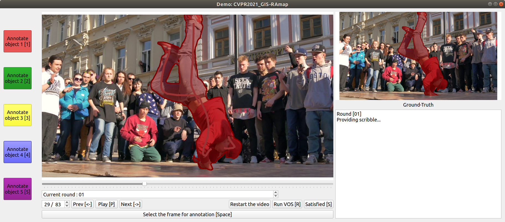
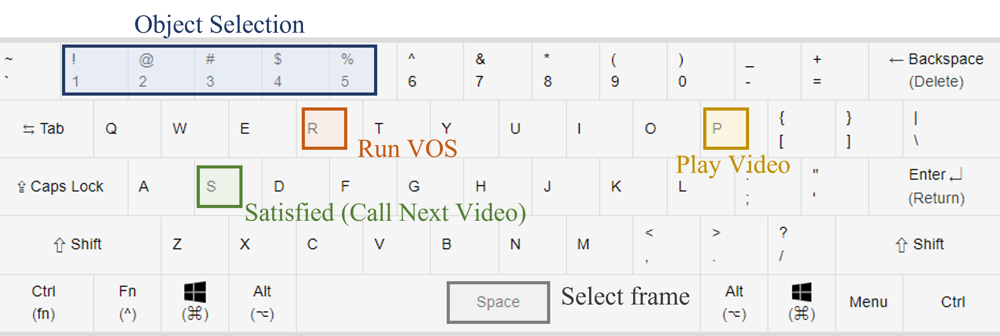

# GUI for iVOS(interactive VOS) and GIS (Guided interactive VOS)

GUI Implementation of 

CVPR2021 paper "Guided Interactive Video Object Segmentation Using Reliability-Based Attention Maps"

ECCV2020 paper "Interactive Video Object Segmentation Using Global and Local Transfer Modules"

Githubs:  
[CVPR2021](https://github.com/yuk6heo/GIS-RAmap) /
[ECCV2020](https://github.com/yuk6heo/IVOS-ATNet)

Project Pages:  
[CVPR2021](http://mcl.korea.ac.kr/yukheo_cvpr2021/) /
[ECCV2020](http://mcl.korea.ac.kr/yukheo_eccv2020/)

Codes in this github:

1. Real-world GUI evaluation on DAVIS2017 based on the [DAVIS framework](https://interactive.davischallenge.org/)
2. GUI for other videos

## Prerequisite
- cuda 11.0
- python 3.6
- pytorch 1.6.0
- [davisinteractive 1.0.4](https://github.com/albertomontesg/davis-interactive)
- numpy, cv2, PtQt5, and other general libraries of python3

## Directory Structure

 * `root/apps`: QWidget apps.

 * `root/checkpoints`: save our checkpoints (pth extensions) here.
 
 * `root/dataset_torch`: pytorch datasets.
 
 * `root/libs`: library of utility files.

 * `root/model_CVPR2021` : networks and GUI models for CVPR2021
     - detailed explanations on [[Github:CVPR2021]](https://github.com/yuk6heo/GIS-RAmap)
 * `root/model_ECCV2020` : networks and GUI models for ECCV2020
     - detailed explanations (including building correlation package) on [[Github:ECCV2020]](https://github.com/yuk6heo/IVOS-ATNet)
  
 * `root/eval_GIS_RS1.py` : DAVIS2017 evaluation based on the [DAVIS framework](https://interactive.davischallenge.org/).
 * `root/eval_GIS_RS4.py` : DAVIS2017 evaluation based on the [DAVIS framework](https://interactive.davischallenge.org/).
 * `root/eval_IVOS.py` : DAVIS2017 evaluation based on the [DAVIS framework](https://interactive.davischallenge.org/).
 * `root/IVOS_demo_customvideo.py` : GUI for custom videos
  
## Instruction

### To run
1. Edit `eval_GIS_RS1.py``eval_GIS_RS4.py``eval_IVOS.py``IVOS_demo_customvideo.py` to set the directory of your DAVIS2017 dataset and other configurations.
2. Download our parameters and place the file as `root/checkpoints/GIS-ckpt_standard.pth`.
    - For CVPR2021 evaluation [[Google-Drive]](https://drive.google.com/file/d/1dkgXJJ2gPYDtPE9yTtlP4Th0iNX5ZG6a/view?usp=sharing)
    - For ECCV2020 evaluation [[Google-Drive]](https://drive.google.com/file/d/1t1VO2zy3pLBXCWqme9h63Def86Y4ECIH/view?usp=sharing)
3. Run `eval_GIS_RS1.py``eval_GIS_RS4.py``eval_IVOS.py` for real-world GUI evaluation on DAVIS2017 or
4. Run `IVOS_demo_customvideo.py` to apply our method on the other videos

### To use


1.
2.

## Reference

Please cite our paper if the implementations are useful in your work:
```
@Inproceedings{
Yuk2021GIS,
title={Guided Interactive Video Object Segmentation Using Reliability-Based Attention Maps},
author={Yuk Heo and Yeong Jun Koh and Chang-Su Kim},
booktitle={CVPR},
year={2021},
url={https://openaccess.thecvf.com/content/CVPR2021/papers/Heo_Guided_Interactive_Video_Object_Segmentation_Using_Reliability-Based_Attention_Maps_CVPR_2021_paper.pdf}
}
```

```
@Inproceedings{
Yuk2020IVOS,
title={Interactive Video Object Segmentation Using Global and Local Transfer Modules},
author={Yuk Heo and Yeong Jun Koh and Chang-Su Kim},
booktitle={ECCV},
year={2020},
url={https://openreview.net/forum?id=bo_lWt_aA}
}
```


Our real-world evaluation demo is based on the GUI of [IPNet](https://github.com/seoungwugoh/ivs-demo):
``` 
@Inproceedings{
Oh2019IVOS,
title={Fast User-Guided Video Object Segmentation by Interaction-and-Propagation Networks},
author={Seoung Wug Oh and Joon-Young Lee and Seon Joo Kim},
booktitle={CVPR},
year={2019},
url={https://openaccess.thecvf.com/content_ICCV_2019/papers/Oh_Video_Object_Segmentation_Using_Space-Time_Memory_Networks_ICCV_2019_paper.pdf}
}
```
